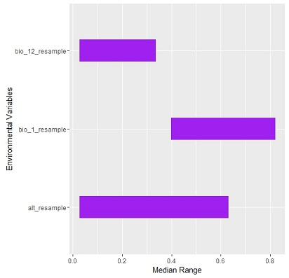

```{r, include = FALSE}
knitr::opts_chunk$set(
  collapse = TRUE,
  comment = "R>"
)
```
# 1. Introduction
The **GARPTools** package provides tools to prepare data for input into the Desktop version of [GARP](http://www.nhm.ku.edu/desktopgarp) (the genetic algorithm for rule-set prediction) and for the evaluation of the accuracy of output models. GARP is a software package for biodiversity and ecological research that allows the user to predict and analyze wild species distributions. GARP is a presence-background genetic algorithm that models species' potential geographic distributions through an iterative process of training and testing that occurs through resampling and replacement of input data.

In particular, **GARPTools** was designed to support:

* Resampling of environmental layers to the same spatial scale and extent
* Cropping of environmental layers to study area
* Removal of duplicate presence points within a single raster cell
* Splitting presence data into training (for input into GARP) and testing data points
* Summation of GARP model outputs into a single best subset raster
* Calculation of the confusion matrix, including model sensitivity and specificity
* Assessment of model accuracy with AUC, commission, and omission metrics
* Plotting of the Receiver Operating Characteristic (ROC) curve
* Plotting the range rules of variables output by GARP

The package is particularly useful when running multiple GARP experiments for multiple species; the data prep and accuracy tools were developed to allow for use during an iterative process. It is also useful when using environmental layers with multiple spatial scales and extents while focusing on a specific study area. 

This document describes the steps required to work between GARP and R (or R Studio) to evaluate the accuracy metrics for a GARP experiment. In the example for this vignette, we are modeling the potential geographic distribution of white-tailed (*Odocoileus virginianus*) in North and South Carolina, United States. We first prepare input files for GARP, then assess the accuracy of models produced an experimental run. The example data set used here is from [GBIF.org](www.gbif.org), a free and open access facility for global biodiversity data. 

# 2. Prepping datasets for GARP
First, install the **devtools** package and read in from the library in order to install the **GARPTools** package from GitHub:
```{r setup, echo = FALSE}
library(GARPTools)
```

```{r eval = FALSE, message = FALSE, warning = FALSE, comment = "R>"}
install.packages(devtools)
library(devtools)

install_github("cghaase/GARPTools")
library(GARPTools)
```

Read in the the white-tailed deer species data from the package in data.frame format:
```{r comment = "R>" , echo = -1}
library(GARPTools)
data("wtdeer_df")
head(wtdeer_df)
```

It is also available as a shapefile:
```{r comment = "R>", echo = -1}
library(GARPTools)
data("wtdeer_locations")
wtdeer_locations
```

We also provide example environmental layers to use in GARP, available as a raster stack:
```{r comment = "R>", echo = -1}
library(GARPTools)
data("env_layers")
env_layers
```

Plotting the raster stack allows for the visualization of all environmental layers (Figure 1).
```{r fig.height=2, fig.align = "center", fig.cap = "Three example environmental layers used in GARP experimental runs.",echo = -1}
library(raster)
plot(env_layers, nc = 3)
```

Now add the boundary of the sampling area and sampling points to the altitude layer (Figure 2).
```{r comment = "R>", echo = -1, fig.width=4, fig.height=3, fig.align = "center", fig.cap = "Altitude of sampling area with sampling points."}
par(mar=c(3,2,2,1))
data("nc_boundary")
plot(env_layers[[1]])
plot(nc_boundary, add = T)
```
**GARPTools** provides tools to prepare the data files for the desktop version of GARP with functions that will resample and crop environmental layers to study areas and split presence locations into training and testing data sets.

## 2.1. Resample raster files and convert to ASCII
In order for GARP to use the environmental layers in its analysis, the rasters must be of the same spatial resolution and extent. The `rasterPrep` function resamples the rasters used in the analysis to the same spatial resolution (i.e. cell size) and extent of a sample raster. The user can define the sample raster using the `res.raster` argument or define the number of cells in a raster row using `cells`; both default as `NULL`. If neither argument is used, the raster with the largest resolution will be defined as the sample raster and all other rasters will be resampled to that spatial resolution. The spatial extent of the rasters can also be defined using the `mask` argument, which reads in a shapefile of the user-defined study area. The rasters are written as ".asc" files to ensure the headers of the files are in the correct format for GARP. **NOTE:** The rasterPrep function may take some time if the spatial resolution is small or there are many rasters to resample. Make sure ONLY the rasters that need to be resampled are in the "raster" folder specified by the `file.path` argument.

Here, we first write the provided rasters into a raster folder for example and then run the resample function.
```{r comment = "R>", warning = FALSE, message = FALSE, results = "hide"}
writeRaster(env_layers[[1]], 
            filename = "C:/GARP/rasters/alt.asc", 
            format = "ascii", 
            overwrite = TRUE)
writeRaster(env_layers[[2]], 
            filename = "C:/GARP/rasters/bio_1.asc", 
            format = "ascii", 
            overwrite = TRUE)
writeRaster(env_layers[[3]], 
            filename = "C:/GARP/rasters/bio_12.asc", 
            format = "ascii", 
            overwrite = TRUE)

rasterPrep(file.path = "C:/GARP/rasters", 
           mask = nc_boundary, 
           output.path = "C:/GARP/resampled/")
```

## 2.2. Filter multiple points per raster pixel
GARP records the instance of a presence location in a raster cell, and therefore does not distinguish between multiple locations within a single cell. The `centroid` function returns the centroid location of all grid cells that contain a presence location, which circumvents multiple locations. The function uses the cell size and extent of user-defined raster (after rasters are resampled in `rasterPrep`) to generate centroid coordinates of all cells that contain presence locations that can then be used in GARP.
```{r comment = "R>"}
alt_resample <- raster("C:/GARP/resampled/alt_resample.asc")

wtdeer_centroids <- centroid(x = alt_resample, 
                             points = wtdeer_locations, 
                             xy = wtdeer_df[,c("Latitude","Longitude")],
                             species = wtdeer_df$Species)
```

The function is useful when input rasters cells are large (and thus contain multiple sampling locations) or when sampling was unevenly clustered. 

## 2.3. Randomly split training and testing points
The presence data can be plotted along with one of the environmental layers that has been cropped to the sampling area to make sure all the points fall within the rasters (the `checkData` function can also check this). Plot the new resampled raster, the original points, and the new centroid locations (in purple) to see the difference in location (Figure 3):
```{r comment = "R>", echo = -1, fig.width=4, fig.height=3, fig.align = "center", fig.cap = "Resampled altitude map of sampling area with sampling points (black) and centroid points (purple)."}
par(mar=c(2,2,2,1))
plot(alt_resample)
points(wtdeer_locations, pch = 16)
points(wtdeer_centroids, col = "purple")
```
A GARP experiment is by design a random walk, described in detail in Stockwell [(1999)](#anchor) and McNyset [(2005)](#anchor2). Because there is no single solution due to the nature of random walks, GARP is evaluated by the total number of models in an experiment (a set of models) that predict a pixel as present. Therefore the GPS location data should be split into training and testing data sets in order to develop and then evaluate the models. The `splitData` function uses a user-defined percentage (`p`) to split the presence locations into training and testing subsets. The `iterations` argument defines the number of resampling occurrences needed for the number of GARP experiments run. For instance, running GARP 10 times would produce 10 sets of models that will individually be assessed, allowing for rankings of the best model rule-sets. This would require 10 separate sets of training and testing presence locations. 

By setting `p` as 0.75 and `iterations` as 10, the `splitData` function randomly selects 75% of the presence locations to subset the initial data set to create a training set of points and repeats this 10 times. The other 25% of the points are reserved for testing post-GARP. By setting `output = TRUE` and specifying an output path, all 10 sets of training and testing points are saved to file. 

It is important to include a root file name that identifies the species, as "test" and "train" will be attached the the file name along with the iteration number (i.e "wtdeer1_test")
```{r comment = "R>"}
splitData(points = wtdeer_centroids, p = 0.75, type = "all", iterations = 10, 
          output = TRUE, output.path = "C:/GARP/", output.name = "wtdeer")
```

The training data must be a MS Excel 97-2003 Worksheet (.xls) in order to work with GARP. The `splitData` function will output .csv files, thus the user is encouraged to convert to .xls before importing into GARP.

# 3. Assess GARP output
The area under the receiver operating characteristic (ROC) curve (AUC) can be calculated to evaluate the predictive performance of the 10 best models output by GARP by relating the model *sensitivity* (true positive rate) to *1-specificity* (true negative rate). AUC determines if the model set is predicting better than a randomly model (AUC = 0.5) and can be described as the probability that any given cell is correctly predicted as present or absent. One can also use internal metrics of *omission* (false negatives; real occurrence points not predicted) and *commission* (the proportion of the landscape incorrectly predicted as present) to select the best performing models in the experiment. In a 200 model experiment with the default best subset settings, GARP would run until at least 20 models were selected for having 10% or less omission (this can be adjusted by the user). Out of those 20 models, GARP would then select the 10 models closest to the median commission values of those 20 models and save them within a "BestSubsets" folder. 

## 3.1. Sum best subset models into a single prediction raster
Collapsing the 10 individual binary presence/absence ESRI grids from the BestSubsets folder of the projected distribution from a single GARP experiment creates a summed raster that represents the number of models that agree on the presence of a species for each pixel. 

First read in the rasterStack of the output ESRI grids available in the GARPTools package and write them into a "BestSubsets" folder to simulate the output from GARP:

```{r comment = "R>"}
data("tasks_layers")

writeRaster(tasks_layers[[1]], "C:/GARP/BestSubsets/task1.asc",  overwrite = TRUE)
writeRaster(tasks_layers[[2]], "C:/GARP/BestSubsets/task2.asc",  overwrite = TRUE)
writeRaster(tasks_layers[[3]], "C:/GARP/BestSubsets/task3.asc",  overwrite = TRUE)
writeRaster(tasks_layers[[4]], "C:/GARP/BestSubsets/task4.asc",  overwrite = TRUE)
writeRaster(tasks_layers[[5]], "C:/GARP/BestSubsets/task5.asc",  overwrite = TRUE)
writeRaster(tasks_layers[[6]], "C:/GARP/BestSubsets/task6.asc",  overwrite = TRUE)
writeRaster(tasks_layers[[7]], "C:/GARP/BestSubsets/task7.asc",  overwrite = TRUE)
writeRaster(tasks_layers[[8]], "C:/GARP/BestSubsets/task8.asc",  overwrite = TRUE)
writeRaster(tasks_layers[[9]], "C:/GARP/BestSubsets/task9.asc",  overwrite = TRUE)
writeRaster(tasks_layers[[10]],"C:/GARP/BestSubsets/task10.asc", overwrite = TRUE)
```

Then sum the best subset model outputs into a single summed raster using the `sumRasters` function:
```{r comment = "R>"}
r.sum <- sumRasters("C:/GARP/BestSubsets/")
```
The `summary` of the summed raster shows that the minimum value is 0 and the maximum is 10:

```{r comment = "R>"}
summary(r.sum)
```

The `frequency` function outputs the frequency of the number of models that agree in predictions: 

```{r  comment = "R>"}
freq(r.sum)
```
## 3.2. Calculate the AUC of the ROC curve 
To calculate the AUC for a discrete variable such as presence, individual cutpoints of the best subset raster act as thresholds of the ROC curve. By calculating the AUC for a finite number of potential thresholds (here defined by the `n` argument), it's equivalent to calculating the non-parametric Wilcoxon's statistic. This is derived from McNyset [(2005)](#anchor2).

AUC is calculated by overlaying one of the testing points (`points` argument) withheld from the sample data using the 'splitData' function on top of the summed raster from the `sumRasters` function (`x` argument):
```{r echo = -1, message = FALSE, warning = FALSE, fig.width=4, fig.height=3, fig.align = "center", fig.cap = "Best subset of models output by DesktopGARP with testing points."}
par(mar=c(2,2,2,1))
test.pts <- shapefile("C:/GARP/wtdeer1_test.shp")
plot(r.sum)
plot(nc_boundary, add = TRUE)
points(test.pts, pch = 16)
```
The pixel value at each testing point is extracted and used to define the confusion matrix (see `confuseMatrix`) and calculate the AUC within the `aucGARP` function, where `n` is the number of models in the BestSubsets folder output by GARP:
```{r echo = -1, comment = "R>", fig.width=4, fig.height=4, fig.align = "center", fig.cap = "Plot of the Receiver Operating Characteristic (ROC) curve."}
par(mar=c(2,2,2,1))
aucGARP(n = 10, x = r.sum, points = test.pts)
```
The ROC plot (Figure 5), standard error and z-value associated with the AUC, and the Wilcoxon test statistic can also be called separately with their respective functions.

## 3.3. Calculate commission and omission metrics 
Total and average commission and omission can be calculated by the confusion matrix. Total commission is calculated as the total number of pixels predicted present across all ten models, divided by the total number of pixels in the study area. Average commission is calculated as the average of the total number of cells predicted present, divided by the total number of pixels within the study area that are unoccupied on a model-by-model basis for each of the 10 models of the best subset folder (directed in the `file.path` argument): 

```{r comment = "R>"}
commissionGARP(n = 10, x = r.sum, points = test.pts, file.path = "C:/GARP/BestSubsets/")
omissionGARP(n = 10, x = r.sum, points = test.pts)
```

Now that we have the AUC score, the commission and omission metrics, and the z-scores and standard error, we can produce a table that ranks the 10 models from highest to lowest AUC scores:


Model |  AUC   | Total Commission | Average Commission  | Total Omission | Average Omission
------|:------:|:----------------:|:-------------------:|:--------------:|:-----------------:
8     | 0.72   |    18.47         |    53.80            |   0.00         |  18.15
9     | 0.72   |    24.99         |    51.01            |   0.11         |  19.22
4     | 0.72   |    26.97         |    61.88            |   0.00         |  13.33
1     | 0.69   |    28.48         |    51.82            |   0.19         |  22.89
10    | 0.68   |    35.63         |    59.63            |   0.00         |  18.89
3     | 0.68   |    26.50         |    54.27            |   0.15         |  25.50
5     | 0.66   |    31.46         |    56.98            |   0.07         |  26.27
7     | 0.66   |    18.41         |    51.22            |   0.07         |  28.12
6     | 0.62   |    27.13         |    51.06            |   0.04         |  35.17
2     | 0.61   |    37.04         |    52.75            |   0.19         |  32.15

Table: Model rankings from a GARP output.

# 4. Extracting rulesets and plotting the median ranges of environmental variables for best subsets
There are four types (range, negated range, logit and atomic) of if-then genetic rules considering different combinations of environmental variables in GARP. Each model includes 50 rules which predict the presence and absence of the species for each pixel. The rule sets .txt file recording all 50 rules for each GARP model will be generated automatically by GARP.

## 4.1. Get the dominant rules for best subsets
Dominant rules for each model are defined as the subset of rules that together predict over 90% of the landscapes. The `FindModRule` function is used to extract a table of dominant rules for the best subsets.

First define a vector object which contains the directories of best subsets for each species and a string of the primary directory for ruleset grids, then run the function:

```{r eval = FALSE, comment = "R>"}
modelRule <- FindModRule(pathA = "C:/GARP/runs/", pathB = "C:/GARP/BestSubsets/")
```

## 4.2. Extract dominant rules for the best subset models from Desktop GARP
Set the directory to where the rule sets .txt file is saved and define the directory for environmental layers. The Boolean argument "project" depends on whether the GARP results are projected to the landscape or not. The `ExtractRules` function will extract the dominant range rules and logit rules for each GARP model. Argument `table` is produced by `FindModRule`. **Note:** The environmental layers must be in ESRI ASCII raster format.

```{r eval = FALSE, comment = "R>"}
rangelogit <- ExtractRules("C:/GARP/RuleSets.txt", 
                           table = modelRule, 
                           pathA = "C:/GARP/resampled/", 
                           pathB = "C:/GARP/runs/",
                           project = FALSE) 
```

Save the table of extracted rules as a .csv file:

```{r eval = FALSE, comment = "R>"}
write.csv(rangelogit, "C:/GARP/RangeLogit.csv") 
```

## 4.3. Calculate the median maximum and median minimum values for each environmental variable
Set a vector object the directories and full file names for the extracted rule .csv files created by function ExtractRules. The `getMedMinMax` function is used to get the median maximum and minimum of each environmental variable for dominant rules:

```{r eval = FALSE, comment = "R>"}
MedMinMax <- getMedMinMax(pathA = "C:/GARP/RangeLogit.csv", 
                          pathB = "C:/GARP/resampled/") 
```

## 4.4. Rescale the median maximum and median minimum values from 0.0 to 1.0
The median range of the environmental variables indicates the role they play to predict the species distribution in the experiment. Rescaling the median maximum and minimum values to 0-1 allows making the comparison without the units.

The argument `file` in the `Rescale` function is a  data.frame of the original median minimum and median maximum values produced by the `getMedMinMax` function for each environment variable:

```{r eval = FALSE, comment = "R>"}
recaledM <- Rescale(MedMinMax) 
```

## 4.5. Visualize the median range for the environmental variables
The `plotRange` function plots the median range for the environmental variables used in the GARP experiments. The argument `file` in the function should b a data.frame of the rescaled ranges of the median minimum and median maximum values for each environment variable, which can be produced by `Rescale` function:

```{r eval = FALSE, comment = "R>"}
plotRange(rescaledM, colour = "purple", n = 15, 
          xlabel = "Environmental Varibles", 
          ylabel = "Median Range")

```
<center><center>
Figure 6: The median range for the environmental variables used in the GARP experiments.

# 5. Variable selection by prevalence and median range
Without a full understanding of the ecology of the species, it is hard to decide the environmental variables to be included or excluded when modelling the spatial distribution. Here, we introduce a method for variable selection typically for GARP model, based on the analysis of the prevalence and median range of the environmental covariates. The rescaled median ranges for environmental variables are calculated by `Rescale` function. In addition, the prevalence of each environmental variable in the dominant presence rules of the ten best subsets is defined as the times of the environmental variable shown in the dominant presence rules divided by the total number of dominant presence rules. The variables with less contribution to the GARP models are the ones with wide median range and low prevalence. Thus, the index of unimportance for GARP model is defined as the following equation:

*Unimportance* = (1 - *prevalence*) * *range*

The multiplication of the median range and the absence of the environmental layers in dominant presence rules can exclude the variables with 1) high prevalence and wide median range; and 2) low prevalence and narrow median range. The variable with high prevalence suggests that most rules in the ten best subsets of GARP models use this variable to predict the presence of the species. The variable with narrow median range suggests that the survival of species depends on a specific environmental condition. Therefore, the higher value the index of unimportance is, the less contribution the environmental variable will have on the GARP models.

## 5.1 Calculate the total number of the dominant presence rules in the ruleset 
Set the directory to where the rule sets .txt file is saved. Set pathA as a string of the directory for environmental layers and pathB as a string of the primary directory for ruleset grids. The Boolean argument `project` depends on whether the GARP results are projected to the landscape or not.  The `TotPresRules` function will return the total number of the dominant presence rules in the ruleset file. The argument "table" is produced by "FindModRul" function. **Note:** the environmental layers must be in ESRI ASCII raster format.

```{r eval = FALSE, comment = "R>"}
PreNo <- TotPresRules(file = "C:/GARP/RuleSets.txt", 
                      table = modelRule, 
                      pathA = "C:/GARP/resampled/", 
                      pathB = "C:/GARP/runs/", 
                      project = FALSE)
```

## 5.2 Get the prevalence of each environmental variable
The prevalence indicates the frequency of each environmental variable shown in the dominant presence rules of the ten best subsets. Set `pathA` as a vector object the directories and full file names for the extracted rule .csv files created by function `ExtractRules`.  Set `pathB` as a string of the directory for environmental layers and `num` as the number of total dominant presence rules which can be generated by the `TotPresRules` function. The `Prevalence` function will return a data frame including the prevalence of each environmental variable in the dominant presence rules in the ten best subsets. **Note:** the environmental layers must be in ESRI ASCII raster format.

```{r eval = FALSE, comment = "R>"}
prevalence <- Prevalence(pathA = "C:/GARP/RuleSets.txt", 
                         pathB = "C:/GARP/runs/", num = 10)
```

Save the table of the prevalence for environmental covariates as a .csv file:
```{r eval = FALSE, comment = "R>"}
write.csv(prevalence, "C:/GARP/Prevalence.csv")
```


## 5.3 Calculate the unimportance index of each environmental variable for variable selection.
The normalized unimportance index is calculated based on the analysis of median range and prevalence of the environmental variables in the dominant presence rules of the ten best subsets in GARP results. This index indicates the relative contribution of each environmental variable in the GARP models. 

Set `table1` as a data frame recording the prevalence of environmental variables generated by `Prevalence` function and `table2` as a data frame with the rescaled median range for each environment variable generated by `Rescale` function. The `UnimportIdx` function will calculate the normalized unimportance index for each environmental variable.

```{r eval = FALSE, comment = "R>"}
UnimportIndex <- UnimportIdx(prevalence, rescaled)
```

Save the table of Unimportance Index as a .csv file:
```{r eval = FALSE, comment = "R>"}
write.csv(UnimportanceIndex,"C:/GARP/UnimportanceIndex.csv")
```


# References
McNyset, KM [(2005)]{#anchor2} Use of ecological niche modelling to predict distributions of freshwater fish species in Kansas. Ecology of Freshwater Fish 14(3): 243-255. 


Stockwell, D [(1999)]{#anchor} The GARP modelling system: problems and solutions to automated spatial prediction, International Journal of Geographical Information Science, 13:2: 143-158.

